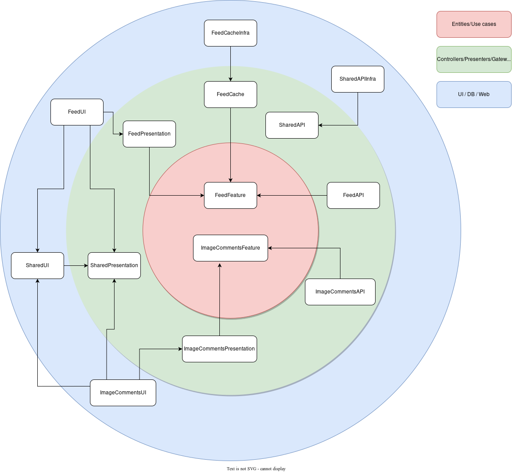

# essential-feed

An implementation matching the Essential Feed case study features. You can read the full specification [here](https://github.com/essentialdevelopercom/essential-feed-case-study/blob/master/README.md). 

In my implementation I have split the code in to separate packages matching the folder structure in the original project. Doing this demonstrates that concerns have been separated following a clean architecture, see the below diagram.

